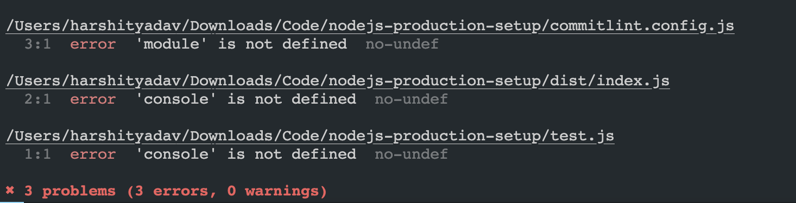

# This repo step by step explains how to start with nodejs production setup

## This setup is based upon MVC architecture.

MVC architecture is a software design pattern for developing web applications. It is made up of three parts: Model, View, and Controller.

## Initial setup

1. Initialize the repo

```
npm init -y
```

2. Install express

```
npm install express
```

3. Create `.gitignore` file and add node_modules

4. Create `index.js` file, and write any `console.log` to check for output

5. Update the scripts in `package.json`

    ```
     "scripts": {
         "start": "node index.js"
    },
    ```

## Husky setup

1. Install `husky` and `lint-staged` as devDependencies

    ```
    npm i husky lint-staged -D
    ```

2. Initialize `husky`

    ```
    npx husky init
    ```

=> A `.husky` folder would be created

## Typescript setup

1. Install typescript

    Installing it as devDependencies because we don't need it in production

    ```
    npm i typescript -D
    ```

2. Setting up `tsconfig.json` file

    ```
    npx tsc --init
    ```

    A tsconfig.json file would be created

3. Update the `tsconfig.json` file

    ```
    {
        "compilerOptions": {
            "target": "es6",
            "module": "commonjs",
            "outDir": "./dist",
            "rootDir": "./src",
            "strict": true,
            "esModuleInterop": true,
            "alwaysStrict": true,
            "strictPropertyInitialization": true,
            "strictNullChecks": true,
            "strictFunctionTypes": true,
            "noUnusedLocals": true,
            "noUnusedParameters": true,
            "noImplicitReturns": true,
            "forceConsistentCasingInFileNames": true,
        }
    }
    ```

4. Install `ts-node` and `@types/node`

    ```
    npm i ts-node @types/node -D
    ```

==> Delete the `index.js` file and create `index.ts` file inside `src` folder

5. Install `nodemon` as dev dependency

    ```
    npm i nodemon -D
    ```

6. Update the scripts in `package.json`

    ```
    "scripts": {
        "start": "node dist/index.js",
        "dev": "nodemon src/index.ts",
        "build": "npx tsc"
    },
    ```

7. Update .gitignore file

    ```
    dist
    ```

## Setting up folder structure


## Commitlint setup

1. Install `@commitlint/cli` and `@commitlint/config-conventional` as devDependencies

    ```
    npm i @commitlint/cli @commitlint/config-conventional -D
    ```

2. Create `commitlint.config.js` file

    ```
    // commitlint.config.js

    module.exports = {
       extends: ['@commitlint/cli', '@commitlint/config-conventional'],
       rules: {
          'type-enum': [
                2, // level: error
                'always', // applicable condition
                [
                   'feat',    // New feature
                   'fix',     // Bug fix
                   'docs',    // Documentation changes
                   'style',   // Code style changes (formatting, missing semi colons, etc.)
                   'refactor',// Code refactoring (neither fixes a bug nor adds a feature)
                   'perf',    // Performance improvements
                   'test',    // Adding missing tests or correcting existing tests
                   'build',   // Changes affecting the build system or external dependencies
                   'ci',      // Changes to CI configuration files and scripts
                   'chore',   // Other changes that don’t modify src or test files
                   'revert'   // Reverts a previous commit
                ]
          ],
          'subject-case': [
                2, // level: error
                'always', // applicable condition
                ['sentence-case', 'start-case', 'pascal-case', 'upper-case']
          ],
       },
    };
    ```

3. Create file `.husky/commit-msg` and add the following code

    ```
    npx --no-install commitlint --edit $1
    ```

## Eslint setup

1. Install `eslint` and `@typescript-eslint/parser` as devDependencies

    ```
    npm install --save-dev eslint @eslint/js @types/eslint__js typescript typescript-eslint
    ```

2. Create eslint configuration file `.eslintrc.js`

    ```
    // @ts-check
    ```

import eslint from '@eslint/js';
import tseslint from 'typescript-eslint';

export default tseslint.config(
eslint.configs.recommended,
...tseslint.configs.recommended,
);

````

3. Run command `npx eslint .`

It will show the errors in the code


4. To fix this, change the following configuration in `.eslint.config.mjs`

   ```
      // @ts-check

   import eslint from '@eslint/js';
   import tseslint from 'typescript-eslint';

   export default tseslint.config(
      {
         languageOptions: {
               parserOptions: {
                  project: true,
                  tsconfigRootDir: import.meta.dirname,
               },
         },
         files: ['**/*.ts'],
         extends: [
               eslint.configs.recommended,
               ...tseslint.configs.recommended,
         ],
         rules: {
               // this is done so that there is no console while we push code to github production
               // large number of consoles slow down the performance of the code
               'no-console': 'off',
               quotes: ['error', 'single', { allowTemplateLiterals: true }],
         }
      }
   );
``
````

## Prettier Setup

1. Install `prettier` and `eslint-config-prettier` as devDependencies

    ```
    npm install --save-dev prettier eslint-config-prettier
    ```

    ```
    npm i --save-dev @types/eslint-config-prettier
    ```

2. Create a `.prettierrc` file

    ```
    {
       "semi": false,
       "singleQuote": true,
       "tabWidth": 3,
       "useTabs": true
    }
    ```

3. Update eslint.config.mjs file

    ```
    import eslintConfigPrettier from 'eslint-config-prettier'
     extends: [
            eslint.configs.recommended,
            ...tseslint.configs.recommended,
            eslintConfigPrettier
        ],
    ```

4. Update package.json file

    ```
    "scripts": {
        "format:check": "prettier . --check",
         "format:fix": "prettier . --fix"
    },
     "lint-staged": {
    "*.ts": [
      "npm run lint:fix",
      "npm run format:fix"
    ]
    },
    ```

## Environment Setup

1. Install `dotenv-flow` to `.env.production` and `.env.development` during different situations

    ```
    npm i dotenv-flow
    ```

2. Install `cross-env` to `NODE_ENV` variable in any OS

    ```
    npm i cross-env
    ```

3. Update `package.json`

    ```
    "start": "cross-env NODE_ENV=production node dist/server.js",
     "dev": "cross-env NODE_ENV=development nodemon src/server.ts",
    ```


## Express setup

1. Install `express` and `@types/express`

    ```
    npm i express 
    npm i @types/express -D
    ```
