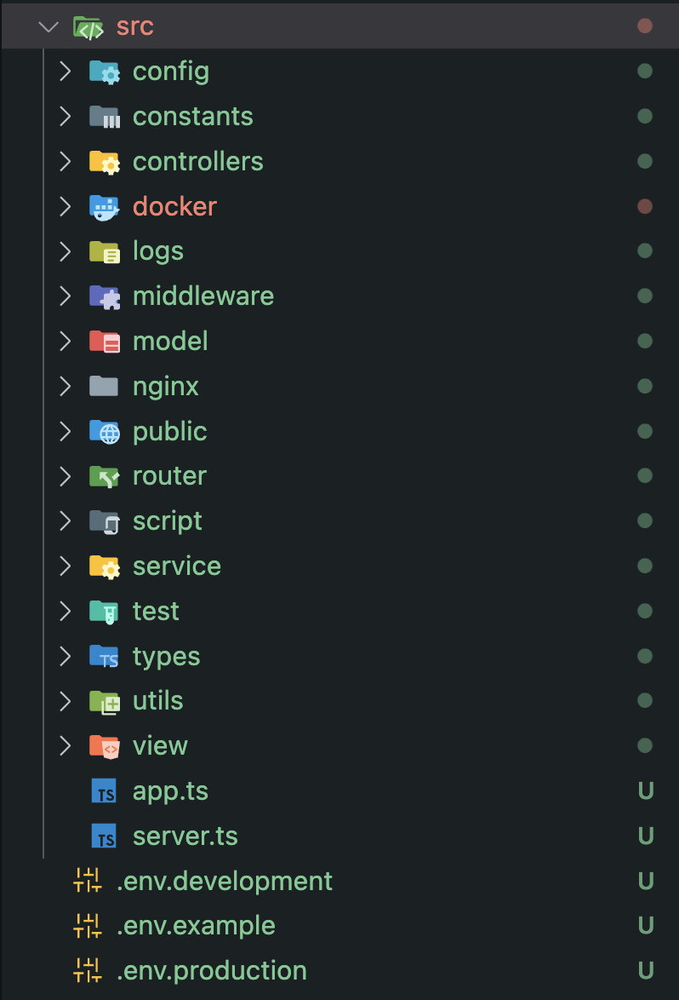

# This repo step by step explains how to start with nodejs production setup

## This setup is based upon MVC architecture.

MVC architecture is a software design pattern for developing web applications. It is made up of three parts: Model, View, and Controller.

## Initial setup

1. Initialize the repo

```
npm init -y
```

2. Install express

```
npm install express
```

3. Create `.gitignore` file and add node_modules

4. Create `index.js` file, and write any `console.log` to check for output

5. Update the scripts in `package.json`

   ```
    "scripts": {
        "start": "node index.js"
   },
   ```

## Husky setup

1. Install `husky` and `lint-staged` as devDependencies

   ```
   npm i husky lint-staged -D
   ```

2. Initialize `husky`

   ```
   npx husky init
   ```

=> A `.husky` folder would be created

## Typescript setup

1. Install typescript

   Installing it as devDependencies because we don't need it in production

   ```
   npm i typescript -D
   ```

2. Setting up `tsconfig.json` file

   ```
   npx tsc --init
   ```

   A tsconfig.json file would be created

3. Update the `tsconfig.json` file

   ```
   {
       "compilerOptions": {
           "target": "es6",
           "module": "commonjs",
           "outDir": "./dist",
           "rootDir": "./src",
           "strict": true,
           "esModuleInterop": true,
           "alwaysStrict": true,
           "strictPropertyInitialization": true,
           "strictNullChecks": true,
           "strictFunctionTypes": true,
           "noUnusedLocals": true,
           "noUnusedParameters": true,
           "noImplicitReturns": true,
           "forceConsistentCasingInFileNames": true,
       }
   }
   ```

4. Install `ts-node` and `@types/node`

   ```
   npm i ts-node @types/node -D
   ```

==> Delete the `index.js` file and create `index.ts` file inside `src` folder

5. Install `nodemon` as dev dependency

   ```
   npm i nodemon -D
   ```

6. Update the scripts in `package.json`

   ```
   "scripts": {
       "start": "node dist/index.js",
       "dev": "nodemon src/index.ts",
       "build": "npx tsc"
   },
   ```

7. Update .gitignore file

   ```
   dist
   ```

## Setting up folder structure



## Commitlint setup

1. Install `@commitlint/cli` and `@commitlint/config-conventional` as devDependencies

   ```
   npm i @commitlint/cli @commitlint/config-conventional -D
   ```